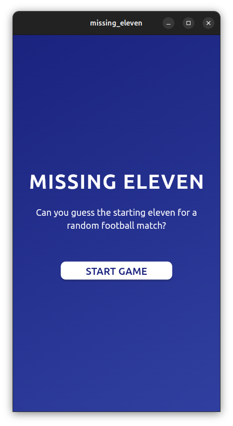
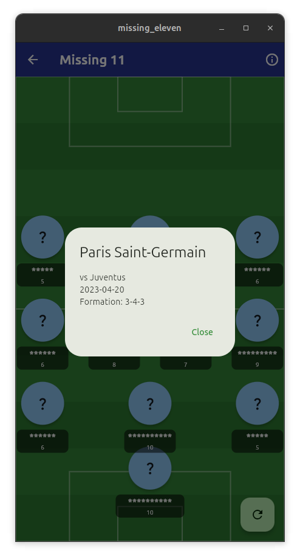
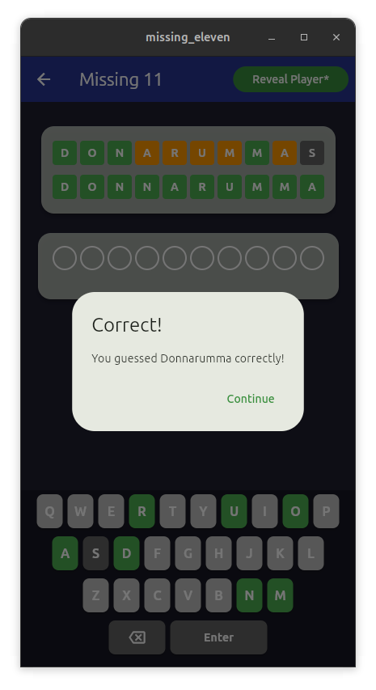
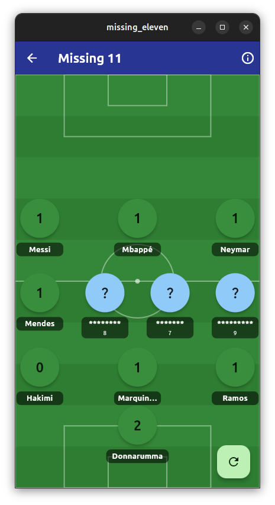

# Missing Eleven Game
#### ICM 24/25 Flutter Homework

### A football team's starting eleven wordle guesser

Guess all the starting 11 players from a team in a random football game in the minimum amount of guesses possible  

<div align="center">
  
  
  
  
</div>

### How to run?

Move into the `missing_eleven` directory
```flutter run ```